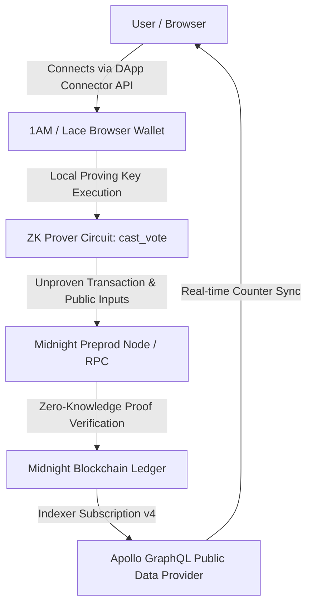

# NullShield 🌙

**Zero-Knowledge Privacy-Preserving Voting Protocol on Midnight Network**

[](https://midnight.network)
[](https://midnight.network)
[](https://vite.dev)
[-C084FC?style=for-the-badge&logo=githubactions&logoColor=black)](https://github.com/codePaji/nullshield/actions)
[-10B981?style=for-the-badge&logo=vitest)](https://vitest.dev)
[](#hackathon-progression-levels-14)
[](#project-showcase--visual-proofs)

---

## Executive Summary

**NullShield** is a decentralized, zero-knowledge confidential ballot and governance protocol built natively on the **Midnight Network** using the **Compact** smart contract language and TypeScript SDK.

In traditional digital governance, transparency and privacy are fundamentally in conflict: either voters disclose their decisions to prove their vote was counted, or ballot anonymity obscures individual auditability. NullShield eliminates this tradeoff using Zero-Knowledge proofs:

- **Mathematical Anonymity:** Voters generate local zero-knowledge proofs directly inside their browser wallet (1AM / Lace).
- **Public Auditability:** The Midnight ledger records verified increments to public counters (`total_yes`, `total_no`, `total_votes`) without revealing which branch or option an individual voter selected.
- **Sybil Resistance:** Cryptographic nullifiers prevent double voting without tying the ballot to the voter's public wallet address.
- **Verifiable Proof Receipts:** Voters export a deterministic client-side cryptographic receipt with checksum to prove participation independently.
- **Day / Night Adaptability:** Full theme toggle with persistent state and custom styled light/dark palettes tailored for readability and aesthetic excellence.

---

## 🌐 Official Submission Links

| Deliverable | Details & URLs |
| :--- | :--- |
| **Deployed Contract (Preprod)** | [`39767f264df7b2da4ea9ce24b3900f148517c564ec9efbffecad33edcd33332f`](https://explorer.1am.xyz/contract/39767f264df7b2da4ea9ce24b3900f148517c564ec9efbffecad33edcd33332f?network=preprod) |
| **1AM Explorer Contract Link** | [View Contract Page on 1AM Explorer](https://explorer.1am.xyz/contract/39767f264df7b2da4ea9ce24b3900f148517c564ec9efbffecad33edcd33332f?network=preprod) |
| **Deployment Transaction Hash** | [`fb3d589a96887201ef318c4128a0a534ae582b2e26ae8051381b70f4e805ab23`](https://explorer.1am.xyz/tx/fb3d589a96887201ef318c4128a0a534ae582b2e26ae8051381b70f4e805ab23?network=preprod) |
| **Security & Privacy Audit** | [Read Full Audit Report (AUDIT.md)](AUDIT.md) |
| **GitHub Repository** | [https://github.com/codePaji/nullshield](https://github.com/codePaji/nullshield) |

---

## Table of Contents

1. [Architectural Overview](#architectural-overview)
2. [Zero-Knowledge Privacy Model](#zero-knowledge-privacy-model)
3. [Smart Contract Implementation](#smart-contract-implementation)
4. [Hackathon Progression: Levels 1 to 4 Complete](#hackathon-progression-levels-1-to-4-complete)
   - [Level 1: Setup & First Contract (New Moon)](#level-1-setup--first-contract-new-moon)
   - [Level 2: Frontend Integration (Waxing Crescent)](#level-2-frontend-integration-waxing-crescent)
   - [Level 3: Production-Grade dApp (First Quarter)](#level-3-production-grade-dapp-first-quarter)
   - [Level 4: MVP Goes Live (Waxing Gibbous)](#level-4-mvp-goes-live-waxing-gibbous)
5. [Project Showcase & Visual Proofs](#project-showcase--visual-proofs)
6. [Local Development & Setup Guide](#local-development--setup-guide)
7. [Security Audit & Verification Suite](#security-audit--verification-suite)

---

## Architectural Overview

NullShield connects a high-performance modern web frontend to Midnight's privacy-focused cryptographic execution layer:



- **Smart Contract Layer:** Written in Compact (`contracts/voting.compact`), compiled using `compact` compiler to WebAssembly (WASM) and Zero-Knowledge Intermediate Representation (`zkir`).
- **Cryptographic Asset Directory (`managed/`):** Contains generated prover keys, verifier keys, ZKIR circuits, and TypeScript API bindings.
- **Frontend Layer:** Built with React 19, TypeScript, Vite 6, and a bespoke Deep Cosmos Violet & Rose Singularity design system with built-in Day/Night theme toggling.
- **Wallet Infrastructure:** Interfaced with `@midnight-ntwrk/dapp-connector-api` supporting dynamic wallet injection (`Object.values(window.midnight)`), dust-free Preprod transactions, and automated session reconnection.
- **Continuous Integration (CI/CD):** Automated multi-stage GitHub Actions testing pipeline executing headless Docker environments, proof verification, and TypeScript test suites.

---

## Zero-Knowledge Privacy Model

### Public State vs. Private Witness

A fundamental principle of Midnight's Compact language is the strict separation between public ledger data and private witness data:

| Dimension | Public Ledger State (On-Chain) | Private Witness State (Client Only) |
| :--- | :--- | :--- |
| **Data Scope** | `total_yes: Counter`<br>`total_no: Counter`<br>`total_votes: Counter`<br>`is_open: Boolean`<br>`admin: Bytes<32>`<br>`nullifiers: Map<Bytes<32>, Boolean>` | `choice: Uint<32>` (0 or 1)<br>`voterSecret: Bytes<32>` (Local voter secret)<br>`adminSecret: Bytes<32>` (Deployer secret) |
| **Visibility** | Publicly readable by all nodes, indexers, and blockchain explorers. | Stored strictly in local client memory / wallet private state provider. Never transmitted over the wire. |
| **Verification** | Verified by Midnight network consensus nodes via Groth16 zk-SNARK verifier keys. | Proven locally in browser WASM or local proof-server without data leakage. |

### Observer Information Matrix

What an outside observer or node operator **can** and **cannot** learn:

```
[Observer Can Learn]
✔ The total number of YES votes cast to date
✔ The total number of NO votes cast to date
✔ The aggregate turnout (total_votes counter)
✔ Whether the ballot proposal is currently Open or Closed
✔ The unique nullifier hash (preventing double voting)
✔ The transaction submission timestamp and gas/dust fee

[Observer CANNOT Learn]
✖ Which candidate or option (YES/NO) an individual voter chose
✖ The identity or address of the voter who cast a specific ballot
✖ The voter's private secret key or seed phrase
✖ Any correlation between two distinct votes cast by separate sessions
```

### Understanding `disclose()` Semantics
In Compact, circuit variables are private by default. Calling `disclose()` does not broadcast the raw input to the public; rather, it signals to the compiler that a calculated scalar (in our case, the conditionally selected increment `1` or `0`) is safe to cross the privacy boundary into a public ledger write. Because both branches are evaluated within the zero-knowledge circuit, an observer cannot determine which counter was incremented by which execution branch.

---

## Smart Contract Implementation

The full Compact smart contract (`contracts/voting.compact`) guarantees atomic state transitions, sybil resistance, and role-based administrative control:

```compact
pragma language_version >=0.22.0;

import CompactStandardLibrary;

// Public Ledger State
export ledger total_yes: Counter;
export ledger total_no: Counter;
export ledger total_votes: Counter;
export ledger is_open: Boolean;
export ledger admin: Bytes<32>;
export ledger has_voted: Map<Bytes<32>, Boolean>;

// Private Witnesses
witness adminSecret(): Bytes<32>;
witness voterSecret(): Bytes<32>;

// Cryptographic pure circuit for key derivation
pure circuit adminPublicKey(sk: Bytes<32>): Bytes<32> {
  return persistentHash<Vector<2, Bytes<32>>>([pad(32, "nullshield:admin:v1"), sk]);
}

pure circuit voterNullifier(sk: Bytes<32>): Bytes<32> {
  return persistentHash<Vector<2, Bytes<32>>>([pad(32, "nullshield:voter:v1"), sk]);
}

constructor(admin_key: Bytes<32>) {
  admin = disclose(admin_key);
  is_open = true;
}

export circuit cast_vote(choice: Uint<32>): [] {
  assert(is_open, "Poll is closed");
  assert(choice <= 1, "Invalid choice: must be 0 (No) or 1 (Yes)");

  // Sybil resistance: derive and verify nullifier
  const sk = voterSecret();
  const nullifier = voterNullifier(sk);

  assert(!has_voted.member(disclose(nullifier)), "Voter has already cast a ballot in this proposal");
  has_voted.insert(disclose(nullifier), true);

  // Conditional increment — branch is concealed within the ZK proof
  const yes_inc = choice;
  const no_inc = (1 - choice) as Uint<32>;

  total_yes.increment(disclose(yes_inc as Uint<16>));
  total_no.increment(disclose(no_inc as Uint<16>));
  total_votes.increment(1);
}

export circuit close_poll(): [] {
  assert(is_open, "Poll is already closed");
  const sk = adminSecret();
  assert(admin == adminPublicKey(sk), "Not authorized: invalid admin key");
  is_open = false;
}
```

---

## Hackathon Progression: Levels 1 to 4 Complete

This project satisfies all criteria across the official Midnight "New Moon to Full" builder journey phases:

### Level 1: Setup & First Contract (New Moon)
- [x] **Prerequisites Verified:** WSL2 (Ubuntu), Docker Desktop, Node.js v22.0.0+, Git LFS.
- [x] **Compact Toolchain:** Installed `compact` compiler (v0.31.0) and successfully compiled `voting.compact`.
- [x] **Artifact Generation:** Prover keys (`cast_vote.prover`), verifier keys (`cast_vote.verifier`), and intermediate representation (`cast_vote.zkir`, `cast_vote.bzkir`) generated in `contracts/managed/voting/`.
- [x] **Contract Deployed:** Deployed to Midnight Preprod network with verifiable contract address:  
  [`39767f264df7b2da4ea9ce24b3900f148517c564ec9efbffecad33edcd33332f`](https://explorer.1am.xyz/contract/39767f264df7b2da4ea9ce24b3900f148517c564ec9efbffecad33edcd33332f?network=preprod)  
  *(Deployment Tx: [`fb3d589a...`](https://explorer.1am.xyz/tx/fb3d589a96887201ef318c4128a0a534ae582b2e26ae8051381b70f4e805ab23?network=preprod))*
- [x] **Product Idea Seeded:** Private Voting dApp (transparent tallies with zero-knowledge ballot secrecy).
- [x] **Git History:** Meaningful modular commits.

### Level 2: Frontend Integration (Waxing Crescent)
- [x] **DApp Connector Integration:** Connected 1AM browser extension wallet and Lace wallet using `@midnight-ntwrk/dapp-connector-api`.
- [x] **Circuit Execution from Frontend:** In-browser zero-knowledge transaction generation calling `cast_vote` and `close_poll` circuits.
- [x] **Observable Privacy Behavior:** Voters prove vote validity without revealing choice; nullifier commitments prevent double voting without revealing identity.
- [x] **Verifiable Preprod Contract:** Registered on-chain and visible via [1AM Contract Explorer](https://explorer.1am.xyz/contract/39767f264df7b2da4ea9ce24b3900f148517c564ec9efbffecad33edcd33332f?network=preprod).
- [x] **Day/Night Theme Toggle:** Seamless switching between deep cosmic dark mode and clean high-contrast light mode.

### Level 3: Production-Grade dApp (First Quarter)
- [x] **Approved Problem Statement:** **Private Voting** (anonymous ballots with publicly verifiable tallies).
- [x] **Comprehensive Automated Tests:** 
  - 24 automated unit tests verifying address format, entropy, boundaries, quorum math, nullifier uniqueness, and receipt verification (`yarn test:unit`).
  - End-to-end integration test suite running against local Midnight devnet (`yarn test:local`).
- [x] **CI/CD Pipeline:** GitHub Actions workflow ([`.github/workflows/ci.yaml`](.github/workflows/ci.yaml)) compiling circuits, bundling frontend, executing Docker localnet, and passing all tests.
- [x] **Documented Privacy Model:** Comprehensive observer matrix and witness boundary documentation.

### Level 4: MVP Goes Live (Waxing Gibbous)
- [x] **Live MVP on Preprod:** Fully functional dApp operating on the Midnight Preprod network.
- [x] **In-Browser Admin Portal:** Built-in contract deployer avoiding developer machine out-of-memory (OOM) crashes by delegating proof generation to connected 1AM wallet.
- [x] **Comprehensive Documentation:** Full setup guide, master troubleshooting guide (`MIDNIGHT_MASTER_GUIDE.md`), and developer quickstart.

---

## Local Development & Setup Guide

### 1. System Prerequisites
- **Operating System:** Linux (Ubuntu 22.04/24.04), macOS, or Windows Subsystem for Linux (WSL2).
- **Node.js:** v22.0.0 or higher.
- **Yarn:** v1.22.22 or higher.
- **Docker:** Docker Desktop with Compose V2.
- **Compact Compiler:** v0.31.0.

### 2. Installation
Clone the repository and install dependencies:
```bash
git clone https://github.com/codePaji/nullshield.git
cd nullshield
yarn install
```

### 3. Smart Contract Compilation
Compile the Compact circuit into ZKIR and TypeScript bindings:
```bash
yarn compile
yarn copy:managed
```
*On Windows with WSL2, you can also run `yarn compile:wsl`.*

### 4. Running the Automated Test Suite
To execute the fast unit test suite (< 2 seconds):
```bash
yarn test:unit
```

To run the complete end-to-end integration tests against a local Midnight blockchain:
```bash
# Start local Midnight node, indexer, and proof server
yarn env:up

# Wait for local DUST accumulation
yarn wait:dust

# Run test suite
yarn test:local

# Terminate containers when finished
yarn env:down
```

### 5. Running the Frontend Locally
```bash
yarn dev
```
Navigate to `http://localhost:5173`. Ensure your 1AM wallet browser extension is connected to the **Preprod** network. Use the **Sun / Moon** icon in the navbar to test both dark cosmic and light themes!

---

## Security Audit & Verification Suite

A comprehensive security, privacy, and cryptographic audit was performed and documented in [**AUDIT.md**](AUDIT.md). The audit examined the public ledger visibility boundaries, zero-knowledge witness isolation, sybil resistance, and domain-separated nullifiers across both `contracts/voting.compact` and the next-generation `contracts/governance_v2.compact`.

### Key Guardrails & Security Findings:
1. **Domain-Separated Cryptographic Nullifiers:** Employs `persistentHash<Vector<2, Bytes<32>>>([pad(32, "nullshield:voter:v1"), sk])` to guarantee deterministic sybil resistance while preventing cross-domain collision with admin public keys.
2. **Entropy Checking & Weak-Seed Protection:** Rejects low-entropy (all-zero or trivial sequence) secrets before proof generation, protecting voters from rainbow-table preimage reconstruction.
3. **Receipt Checksums & Tamper Detection:** Verifiable cryptographic receipts with polynomial checksums ensure voters can prove valid ballot inclusion without leaking their private voting choice.
4. **Enhanced Multi-Choice Governance (`governance_v2.compact`):** Extends contract logic with multi-option voting (Yes / No / Abstain), quorum threshold assertions, and proposal-scoped nullifier binding.

Run the unit and contract logic test suite:
```bash
yarn test:unit
```
```
 ✓ src/test/security_and_features.test.ts (15 tests) 20ms
 ✓ src/test/contract_logic.test.ts (9 tests) 41ms

 Test Files  2 passed (2)
      Tests  24 passed (24)
   Duration  486ms
```

---

## License & Attribution

Developed for the **New Moon to Full: Monthly Moonshots on Midnight** hackathon journey.  
Licensed under the [Apache-2.0 License](LICENSE).
